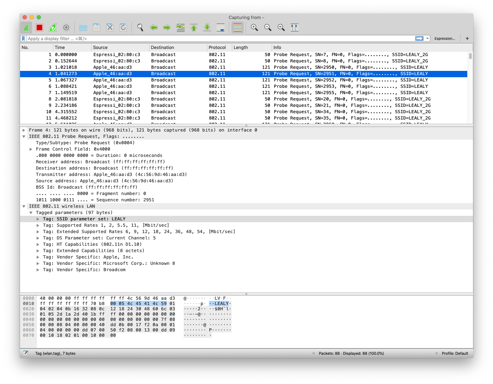

# ESP32 Wifi Sniffer for live Wireshark capture

Use ESP32 promiscuous mode to capture frame and send them over serial connection to a Python script that writes a PCAP file and start Wireshark with live capture.

Works on OS X, Linux.

Serial data is human readable, with packet timestamp + size, then packet data as hexstrings:

```
$ make monitor
D:0100000063690b00650000006500000040000000ffffffffffffb8e85617ceceffffffffffff80c100054c45414c59010402040b1632080c1218243048606c0301062d1aad4917ffff0000000000000000000000000000000000000000007f080400000000000040dd0b0017f20a00010400000000
D:04000000016d0c00d2000000d200000040000000ffffffffffffb827eb98c70bffffffffffff80bc0000010402040b1632080c1218243048606c0301062d1a21001fff00000000000000000000000000000000000000000000dd690050f204104a000110103a00010010080002314810470010fb97404916565875a860726c0fe2c424105400080000000000000000103c00010110020002000010090002000010120002000010210001201023000120102400012010110001201049000600372a000120dd11506f9a0902020025000605005858045106dd09001018020000000000
```

`Capture.py` decode this serial stream, saves a PCAP file names `capture_YYYYMMDD_HHMMSS.pcap` and opens Wireshark.

# Configure

# Building

Builds with ESP-IDF v4.x

Build & flash:
`$ idf.py build`
`$ cd build`
`$ make flash`

Or flash the prebuilt binaries directly:
`$ esptool.py --chip esp32 -p /dev/ttyS6 -b 921600 --before=default_reset --after=hard_reset write_flash --flash_mode dio --flash_freq 40m --flash_size 2MB 0x1000 bootloader.bin 0x10000 hello-world.bin 0x8000 partition-table.bin

Start `Capture.py port channel mac` or `Capture.py port channel` if you want to capture all traffic(this will torque our serial port with only 921600 baud rate)

```
$ ./Capture.py /dev/ttyS6 11 34:94:54:47:f9:f4
Port: /dev/ttyS6 Channel: 1 Mac: 34:94:54:47:f9:f4
Creating capture file: capture_ch1_20230213_103442.pcap
Waiting for packets...
Channel set to 1
D:0000000074390e00180000001800000048113c00d8ece50f875934945447f9f4d8ece50f8759709c
D:00000000f43e0f00180000001800000048013c00d8ece50f875934945447f9f4d8ece50f8759809c
D:0000000091410f00600000006000000088422c0034945447f9f4d8ece50f8759d8ece50f8758800900009700002000000000f022074b2d60d65c39b882246fc3c3fe75064bd53764bb4ffc8c04bb0d4ab95cefe3b9c881dc762ef94ddea35a6eb16faac0e8520f2c0c5ce22e2a750b33
D:01000000574300006000000060000000884a2c0034945447f9f4d8ece50f8759d8ece50f8758800900009700002000000000f022074b2d60d65c39b882246fc3c3fe75064bd53764bb4ffc8c04bb0d4ab95cefe3b9c881dc762ef94ddea35a6eb16faac0e8520f2c0c5ce22e2a750b33
D:0100000002870000180000001800000048113c00d8ece50f875934945447f9f4d8ece50f8759909c
D:010000006d640100180000001800000048013c00d8ece50f875934945447f9f4d8ece50f8759a09c
D:010000001e210200180000001800000048113c00d8ece50f875934945447f9f4d8ece50f8759b09c
D:0200000042420000180000001800000048013c00d8ece50f875934945447f9f4d8ece50f8759c09c
D:02000000744a00004e0000004e00000088412c00d8ece50f875934945447f9f4ffffffffffff00030600f300002000000000fd6e936a49ce066e726ed049dff42455543f252a7d8ccfd0e688dbcf6031fb4704835227df4c2939f3d5b4f2
D:02000000a9e40000180000001800000048113c00d8ece50f875934945447f9f4d8ece50f8759d09c
D:0200000083c00100180000001800000048013c00d8ece50f875934945447f9f4d8ece50f8759e09c
...
```

Enjoy:



